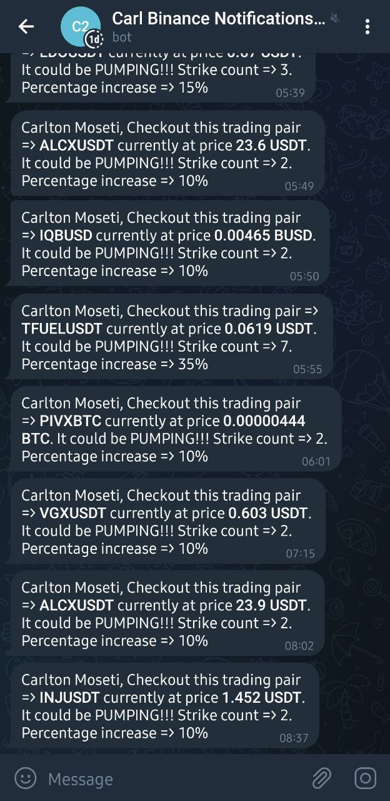

# Binance Telegram Notifications

## Introduction
A Node Typescript application that notifies user via Telegram quick market moves (pumps) at [Binance Exchange](https://accounts.binance.com/en/register?ref=35989968)

## Setup
Documentation in progress...

## Donate
1. Binance Smart Chain (BSC) Mainnet:
[0x36904DfDBa46a7E11b5662C9c39C90A551c8eC93](https://bscscan.com/address/0x36904dfdba46a7e11b5662c9c39c90a551c8ec93)
2. Ethereum Mainnet (ERC20):
[0x36904DfDBa46a7E11b5662C9c39C90A551c8eC93](https://etherscan.io/address/0x36904dfdba46a7e11b5662c9c39c90a551c8ec93)
3. TRON (TRC20):
[TBqoLDpYdXrM5BUUbSiV2m7nKyehhTMmLP](https://tronscan.io/#/address/TBqoLDpYdXrM5BUUbSiV2m7nKyehhTMmLP)

## Screenshots

**Telegram Notification**

## Contact
[carljefe@protonmail.com](mailto:carljefe@protonmail.com)